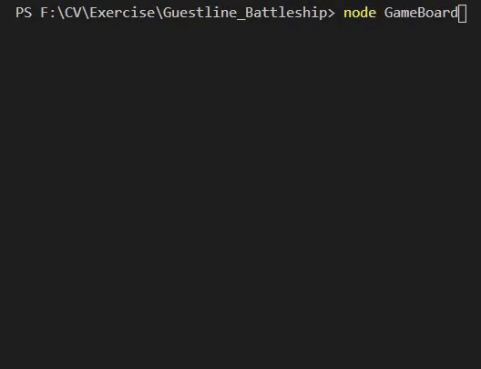

# Guestline Battleship
The challenge is to program a simple version of the game Battleships. (**Single human player**; **one-sided game**)

## How to run?
```
npm install
```

```
node GameBoard
```

## Tests

```
npm test -- -w
```


## Create an application to allow: 

1) Single human player

2) Play a one-sided game of Battleships against ships placed by the computer.

3) The program should create a 10x10 grid

4) Place ships at random:

  * 1x Battleship (5 squares) 

  * 2x Destroyers (4 squares)

## Gameplay:

1) The player enters or selects coordinates of the form “A5”, where “A” is the column and “5” is the row, to specify a square to target. 



2) Shots result in hits, misses or sinks.


3) The game ends when all ships are sunk.


*You can write a console application or UI to complete the task. 
Try to code the challenge as you would approach any typical work task; we are not looking for you to show knowledge of frameworks or unusual programming language features. 
Most importantly, keep it simple.*
